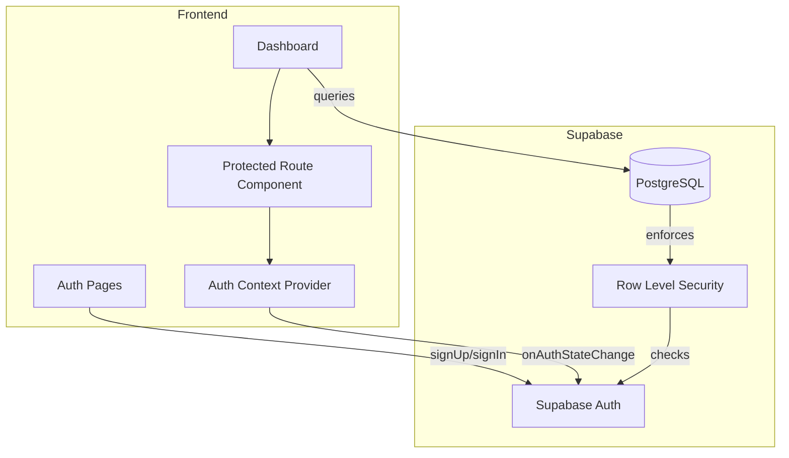

# Design Document: User Authentication

## Overview

This design adds user authentication to Linkly using Supabase Auth. The implementation provides email/password authentication, session management, protected routes, and Row Level Security (RLS) to ensure users can only access their own data.

The design prioritizes:
- **Security**: Proper session handling, password requirements, and data isolation
- **User Experience**: Clear error messages, loading states, and smooth redirects
- **Maintainability**: Centralized auth logic with React context
- **Supabase Integration**: Leveraging built-in auth features and RLS

## Architecture



## Components and Interfaces

### 1. Auth Context

Provides authentication state and methods throughout the app.

```typescript
interface AuthContextType {
  user: User | null;
  session: Session | null;
  loading: boolean;
  signUp: (email: string, password: string) => Promise<AuthResult>;
  signIn: (email: string, password: string, rememberMe?: boolean) => Promise<AuthResult>;
  signOut: () => Promise<void>;
  resetPassword: (email: string) => Promise<AuthResult>;
  updatePassword: (newPassword: string) => Promise<AuthResult>;
}

interface AuthResult {
  success: boolean;
  error?: string;
}

interface User {
  id: string;
  email: string;
  emailVerified: boolean;
  createdAt: string;
}
```

### 2. Auth Service

Wraps Supabase Auth methods with error handling.

```typescript
interface AuthService {
  signUp(email: string, password: string): Promise<AuthResponse>;
  signIn(email: string, password: string): Promise<AuthResponse>;
  signOut(): Promise<void>;
  resetPassword(email: string): Promise<AuthResponse>;
  updatePassword(newPassword: string): Promise<AuthResponse>;
  getSession(): Promise<Session | null>;
  onAuthStateChange(callback: (session: Session | null) => void): () => void;
}

interface AuthResponse {
  user: User | null;
  session: Session | null;
  error: AuthError | null;
}
```

### 3. Protected Route Component

HOC that guards routes requiring authentication.

```typescript
interface ProtectedRouteProps {
  children: React.ReactNode;
  redirectTo?: string;
}

// Usage: <ProtectedRoute><Dashboard /></ProtectedRoute>
```

### 4. Auth Pages

```typescript
// Login page props
interface LoginPageProps {
  onSuccess?: () => void;
  redirectTo?: string;
}

// Register page props  
interface RegisterPageProps {
  onSuccess?: () => void;
  redirectTo?: string;
}

// Password reset page props
interface ResetPasswordPageProps {
  onSuccess?: () => void;
}
```

## Data Models

### Updated Links Table (with user_id)

```sql
-- Add user_id column to links table
ALTER TABLE links ADD COLUMN user_id UUID REFERENCES auth.users(id);

-- Create index for user queries
CREATE INDEX idx_links_user_id ON links(user_id);
```

### Row Level Security Policies

```sql
-- Enable RLS on links table
ALTER TABLE links ENABLE ROW LEVEL SECURITY;

-- Policy: Users can only see their own links
CREATE POLICY "Users can view own links" ON links
  FOR SELECT USING (auth.uid() = user_id);

-- Policy: Users can only insert their own links
CREATE POLICY "Users can insert own links" ON links
  FOR INSERT WITH CHECK (auth.uid() = user_id);

-- Policy: Users can only update their own links
CREATE POLICY "Users can update own links" ON links
  FOR UPDATE USING (auth.uid() = user_id);

-- Policy: Users can only delete their own links
CREATE POLICY "Users can delete own links" ON links
  FOR DELETE USING (auth.uid() = user_id);

-- Enable RLS on click_events table
ALTER TABLE click_events ENABLE ROW LEVEL SECURITY;

-- Policy: Users can view click events for their links
CREATE POLICY "Users can view own click events" ON click_events
  FOR SELECT USING (
    EXISTS (
      SELECT 1 FROM links WHERE links.id = click_events.link_id AND links.user_id = auth.uid()
    )
  );

-- Policy: Anyone can insert click events (for tracking)
CREATE POLICY "Anyone can insert click events" ON click_events
  FOR INSERT WITH CHECK (true);
```


## Correctness Properties

*A property is a characteristic or behavior that should hold true across all valid executions of a system-essentially, a formal statement about what the system should do. Properties serve as the bridge between human-readable specifications and machine-verifiable correctness guarantees.*

### Property Reflection

After analyzing the acceptance criteria, the following were identified as testable properties:
- Password validation (1.3) is a clear input validation property
- Session clearing (3.2) can be tested as a round-trip property
- Link ownership properties (5.1-5.4) are core security properties that must hold for all users and links
- Properties 5.2, 5.3, and 5.4 can be combined into a single "data isolation" property

### Properties

**Property 1: Password length validation**
*For any* password string shorter than 8 characters, the signUp function SHALL reject the registration with a validation error.
**Validates: Requirements 1.3**

**Property 2: Session clearing on logout**
*For any* authenticated session, after calling signOut, the getSession function SHALL return null.
**Validates: Requirements 3.2**

**Property 3: Link ownership assignment**
*For any* link created by an authenticated user, the link's user_id field SHALL equal the authenticated user's ID.
**Validates: Requirements 5.1**

**Property 4: Data isolation - query filtering**
*For any* authenticated user querying links, the result set SHALL contain only links where user_id matches the authenticated user's ID.
**Validates: Requirements 5.2, 5.3, 5.4**

## Error Handling

### Authentication Errors
- Invalid credentials: Display generic "Invalid email or password" message
- Email already registered: Display "An account with this email already exists"
- Weak password: Display specific password requirements
- Network errors: Display "Unable to connect. Please try again."
- Session expired: Redirect to login with "Your session has expired" message

### Authorization Errors
- Accessing other user's data: Return 404 (not 403) to prevent information leakage
- RLS violations: Handled automatically by Supabase, returns empty results

### Form Validation
- Email format: Validate client-side before submission
- Password match: Validate confirm password matches password
- Required fields: Prevent submission with empty required fields

## Testing Strategy

### Unit Testing
- Test auth service methods in isolation with mocked Supabase client
- Test form validation logic
- Test protected route component behavior

### Property-Based Testing
Using `fast-check` library for TypeScript property-based testing.

Each property test will:
- Run minimum 100 iterations
- Use smart generators constrained to valid input space
- Be tagged with the property number and requirements reference

**Generator Strategy:**
- `Email` generator: Valid email format strings
- `Password` generator: Strings of varying lengths for validation testing
- `User` generator: Valid user objects with IDs

### Integration Testing
- Test full registration → verification → login flow
- Test RLS policies with multiple users
- Test session persistence across page reloads

### Test Organization
```
services/
  __tests__/
    authService.test.ts           # Unit tests
    authService.property.test.ts  # Property tests
    passwordValidation.property.test.ts
    dataIsolation.property.test.ts
components/
  __tests__/
    ProtectedRoute.test.tsx
    LoginForm.test.tsx
    RegisterForm.test.tsx
```
